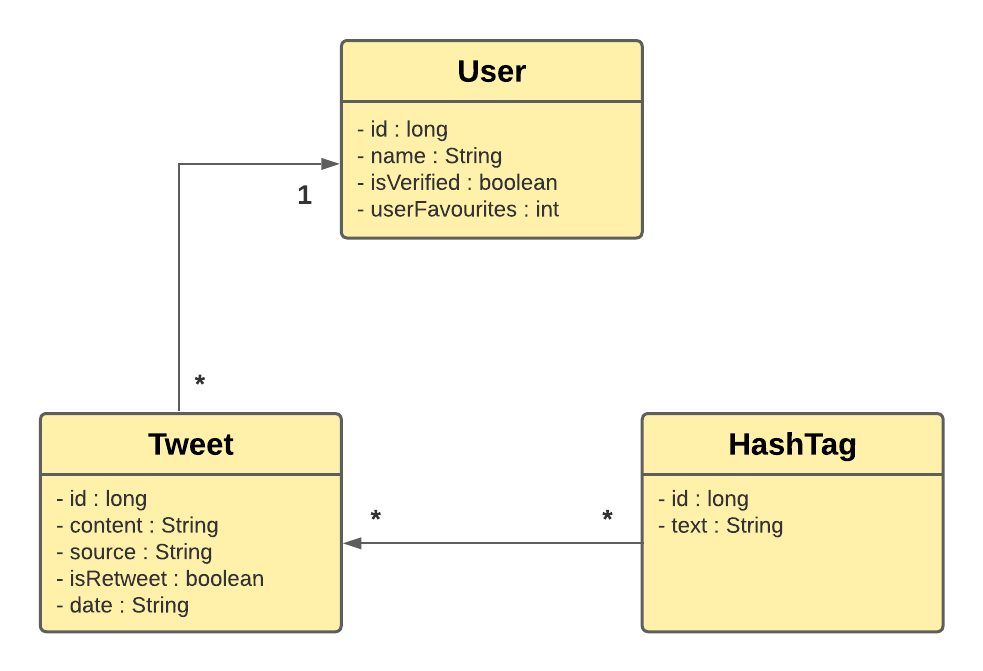

<h1 align="center"> Grupo 15 - P2 - Maven Final </h1>
<h6 align="center"> Federico Colombo - Yabel Neves </h6>

## Índice

* [Actualización de UML](#actualizacion-uml)
* [Procesos de Carga](#descripción)
* [Estructura](#estructura)

## Actualización UML

 Se agrega a la entidad 'User' los atributos: isVerified, del tipo boolean y userFavourites, del tipo int. 

 Se agrega a la entidad 'Tweet' el atributo: date, del tipo String. 

## Procesos de Carga 

#### Lectura de Drivers

 
    Empezamos definiendo la ruta del archivo de conductores en la variable driversFile. Luego utilizamos un bloque 
try-with-resources para abrir y leer el archivo de forma segura, creamos un BufferedReader para leer el archivo y se 
inicia un ciclo while para leer cada línea del archivo.
En cada iteración, se agrega la línea leída (en minúsculas) a la lista enlazada driversLinkedList, cuando el ciclo 
finaliza el bloque try-with-resources cierra automáticamente el BufferedReader. Si ocurre un problema, se tira la 
Excepción IOException. 

#### Lectura CSV

 
    Es un proceso similar al descripto anteriormente, definimos la ruta del archivo CSV en la variable csvFile,
utilizamos un bloque try-with-resources (abrir y leer de forma segura) y creamos un BufferedReader para leer el archivo.
Saltamos la primera fila del archivo que contiene los nombres de las columnas utilizando csvParser.iterator().next(), para comenzar a 
iterar sobre cada fila del archivo utilizando un bucle 'for' y el objeto CSVRecord proporcionado por el CSVParser.
Los valores de cada columna del registro son extraídos y se almacenan en un arreglo 'values'.

##### Procedimiento de Creacion de Tweet, User y HashTag

 
La clase ReadCSV comienza con la creación de dos listas: userList (User) y tweetList (Tweet)
El método readCSV se inció creando un objeto Tweet al que se le asignan los valores correspondientes a sus propiedades utilizando los 
índices en el arreglo values, junto con la creación de unalista enlazada 'hashTagTweet' para almacenar los hashtags del tweet.
Se obtiene la columna de hashtags del registro y se verifica si está vacía, si no lo está, el texto se divide en hashtags utilizando 
'split()' y se crea un objeto 'HashTag' para cada hashtag, los cuales son agregados a la lista hashTagTweet. Finalmente se agrega el objeto Tweet 
a la lista enlazada tweetList.
Se crea User y se asignan los valores utilizando el mismo mecanismo que en Tweet. Se verifica si la lista userList ya contiene al usuario, si es así, 
se obtiene la referencia al usuario existente y se agrega el tweet a su lista de tweets. Si no existe, se agrega el tweet a la lista de tweets del usuario 
y se agrega el usuario a la lista userList. Se capturan y se ignoran las excepciones generales (usando un bloque try-catch vacío) para evitar que los 
errores de formato en los valores del archivo interrumpan el proceso de carga. Si ocurre alguna excepción de lectura del archivo, se lanza una excepción
personalizada FileNotValidException con un mensaje de error adecuado.
En resumen, la función getCsvInfo lee un archivo CSV, línea por línea, y crea objetos Tweet y User con los valores de cada registro.
Los tweets se agregan a la lista tweetList y los usuarios se agregan a la lista userList, con una estructura de datos enlazada. 
También se manejan excepciones para asegurar que el proceso de carga no se interrumpa por errores de formato en el archivo.

## Estructura
Describe la estructura de directorios y archivos principales del proyecto. 
Explica brevemente el propósito de cada componente importante.

